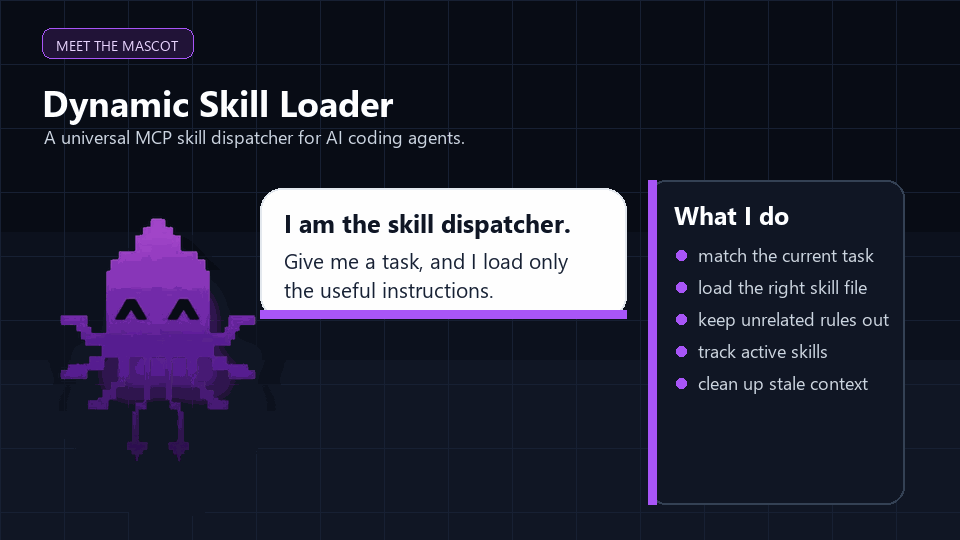

[](LICENSE)
[]()
[](https://github.com/farhanic017)

# Dynamic Skill Loader — Always-on skill dispatcher for any AI coding tool

> Created by [Farhan Dhrubo](https://github.com/farhanic017) — [Submit an issue](https://github.com/farhanic017/dynamic-skill-loader-for-opencode/issues)

An MCP server that loads AI coding skills **on-demand** by matching **trigger keywords** against your task — just like Claude Code's built-in skill system.

**Always-on:** Add `ALWAYS_ON.md` to your AI client's permanent instructions so the model calls `match_skills` at the start of EVERY task automatically.

Works with **OpenCode**, **Claude Desktop/Code**, **Cursor**, **Windsurf**, **Continue.dev**, **VS Code / VS Studio Code**, **VSCodium**, **Antigravity 1.x & 2.x**, **Aider**, and any MCP-compatible client.

Stop loading 50+ skills at startup. Only load what you need, when you need it.

---

## 📥 Drop-in repo URL install

Drop this URL into your AI assistant for fully automatic installation:

```
https://github.com/farhanic017/dynamic-skill-loader-for-opencode
```

Your AI will clone the repo, run `python install.py`, which detects your AI
client (opencode, Claude Desktop, Cursor), configures the MCP server, and
creates sample skills — all automatically.

---


## How it works

```
You: "build a hero section with GSAP animations"
       │
       ▼
skill-dispatcher matches triggers
       │
       ▼
Returns: gsap-core, gsap-scrolltrigger, frontend-design
       │
       ▼
You call get_skill("gsap-core") → full instructions loaded
```



**4 tools:**

| Tool | What it does |
|------|-------------|
| `match_skills(query)` | Matches your task against skill `triggers` and `description` fields (normalizes hyphens, punctuation for fuzzy matching) |
| `get_skill(name)` | Loads the full `SKILL.md` content of a matched skill |
| `list_skills()` | Browses all available skills and their trigger keywords |
| `unload_skill(name)` | Marks a skill as no longer needed — tells the model to drop it from context when switching tasks |

## Quick start

### 1. Install

```bash
npm install -g skill-dispatcher
```

Or run directly with npx:

```bash
npx skill-dispatcher --skills-dir ./my-skills
```

### 2. Point it at your skills

Your skills should follow the Claude Code skill format — each skill is a directory with a `SKILL.md` file containing YAML frontmatter:

```markdown
---
name: gsap-core
description: Core GSAP animation library
triggers:
  - "gsap"
  - "web animation"
  - "tween"
  - "easing"
---
# gsap-core
Full skill instructions here...
```

### 3. Add to your AI tool

#### OpenCode — always-on via `ALWAYS_ON.md`

Add to `opencode.jsonc`:

```jsonc
{
  "instructions": [
    "path/to/ALWAYS_ON.md",     // <-- always-on: auto-calls match_skills at task start
    "path/to/instructions.md"
  ],
  "mcp": {
    "skill-dispatcher": {
      "type": "local",
      "command": ["npx", "skill-dispatcher", "--skills-dir", "/path/to/skills"],
      "enabled": true
    }
  }
}
```

The `ALWAYS_ON.md` file injects a permanent rule: "Call `match_skills` at the
START of every task" — so the dispatcher is always-on, never forgotten.

#### Claude Desktop

Add to `claude_desktop_config.json`:

```json
{
  "mcpServers": {
    "skill-dispatcher": {
      "command": "npx",
      "args": ["skill-dispatcher", "--skills-dir", "/path/to/skills"]
    }
  }
}
```

#### Cursor

Add in Cursor's MCP server settings:

```
Name: skill-dispatcher
Type: command
Command: npx skill-dispatcher --skills-dir /path/to/skills
```

#### Windsurf

Add in Windsurf's MCP server settings (same format as Cursor):

```
Name: skill-dispatcher
Type: command
Command: npx skill-dispatcher --skills-dir /path/to/skills
```

#### Continue.dev

Add to `~/.continue/config.json`:

```json
{
  "mcpServers": {
    "skill-dispatcher": {
      "command": "npx",
      "args": ["skill-dispatcher", "--skills-dir", "/path/to/skills"]
    }
  }
}
```

#### VS Code / VS Studio Code (`mcp.json`)

VSCode uses the `"servers"` key (not `"mcpServers"`). Add to your user or
workspace `mcp.json`:

```json
{
  "servers": {
    "skill-dispatcher": {
      "type": "stdio",
      "command": "npx",
      "args": ["skill-dispatcher", "--skills-dir", "/path/to/skills"]
    }
  }
}
```

**Config path (user):** `%APPDATA%\Code\User\mcp.json` (Windows) or
`~/Library/Application Support/Code/User/mcp.json` (macOS).

Open via Command Palette: `MCP: Open User Configuration`.

#### VSCodium (open-source VS Code fork)

Same format as VSCode — uses `"servers"` key:

```json
{
  "servers": {
    "skill-dispatcher": {
      "type": "stdio",
      "command": "npx",
      "args": ["skill-dispatcher", "--skills-dir", "/path/to/skills"]
    }
  }
}
```

**Config path:** `%APPDATA%\VSCodium\User\mcp.json` (Windows) or
`~/.config/VSCodium/User/mcp.json` (macOS/Linux).

#### Antigravity 1.x (VS Code fork)

Antigravity 1.x uses the native `"servers"` format like VSCode:

```json
{
  "servers": {
    "skill-dispatcher": {
      "type": "stdio",
      "command": "npx",
      "args": ["skill-dispatcher", "--skills-dir", "/path/to/skills"]
    }
  }
}
```

**Config path:** `%APPDATA%\Antigravity\User\mcp.json` (Windows).

#### Antigravity 2.x (Google AI-first IDE)

Antigravity 2.x uses standard `"mcpServers"` format:

```json
{
  "mcpServers": {
    "skill-dispatcher": {
      "command": "npx",
      "args": ["skill-dispatcher", "--skills-dir", "/path/to/skills"]
    }
  }
}
```

**Config path:** `%USERPROFILE%\.gemini\antigravity\mcp_config.json` (Windows).

Open via Agent Panel → `...` → Manage MCP Servers → View raw config.

## Local model compatibility

The dispatcher is a **pure MCP server** — it communicates via JSON-RPC over stdio. It does not depend on any specific AI model, API key, or cloud service. This means it works identically with:

- **Local models** via Ollama, LM Studio, llama.cpp, GPT4All
- **Cloud models** via OpenAI, Anthropic, Google, OpenRouter
- **Any MCP-compatible client** (opencode, Claude Desktop, Cursor, Windsurf, Continue.dev)

The model never talks to the dispatcher directly — the MCP client (e.g., opencode) handles all communication. The dispatcher simply receives JSON-RPC messages and returns responses, regardless of what model is driving the conversation.

To use with a local model in opencode:
```jsonc
{
  "model": "ollama/llama3.2",          // local model
  "mcp": {
    "skill-dispatcher": {
      "type": "local",
      "command": ["npx", "skill-dispatcher", "--skills-dir", "/path/to/skills"],
      "enabled": true
    }
  }
}
```

## Trigger matching

The dispatcher normalizes both your query and skill triggers before matching:

- **Lowercases everything**
- **Strips hyphens, underscores, punctuation** — so `"web-animation"` matches trigger `"web animation"`
- **Collapses whitespace**
- **Substring matching both ways** — your query can contain part of a trigger, or a trigger can contain part of your query

This means `"gsap anim"`, `"GSAP Animation!"`, and `"gsap-anim-timeline"` all match a skill with trigger `"gsap timeline animation"`.

## Creating skills

Each skill is a directory with a `SKILL.md` file. The frontmatter controls matching:

```yaml
---
name: my-skill          # Display name
description: |           # Matched against your query
  What this skill does
triggers:                # Keywords that activate this skill
  - "keyword1"
  - "keyword2"
---
# Full markdown content
Instructions, examples, API docs...
```

## CLI modes

### MCP server mode (default)

Run without action flags to start the MCP server. AI tools connect to this via stdio:

```bash
skill-dispatcher --skills-dir ./skills
```

### Direct terminal mode

Use action flags to query skills directly from your terminal:

```bash
# List all skills
skill-dispatcher --skills-dir ./skills --list

# Match skills by trigger keywords
skill-dispatcher --skills-dir ./skills --match "animation gsap"

# Get full skill content
skill-dispatcher --skills-dir ./skills --get gsap-core

# Show help
skill-dispatcher --help
```

This makes it useful in shell scripts, CI/CD pipelines, or any workflow where you need to discover and load skills programmatically.

## Options

| Flag | Alias | Default | Description |
|------|-------|---------|-------------|
| `--skills-dir` | `-s` | `./skills` | Path to skills directory |
| `--list` | `-l` | — | List all available skills |
| `--match` | `-m` | — | Match skills by trigger keywords (requires a query) |
| `--get` | `-g` | — | Get full content of a specific skill (requires name) |
| `--unload` | `-u` | — | Forget a previously loaded skill (requires name) |
| `--help` | `-h` | — | Show help |

## Project Structure

```
skill-dispatcher/
├── index.mjs             # MCP server & CLI (skill matching engine)
├── install.py            # Auto-installer
├── test.mjs              # Test suite (27 tests, all passing)
├── make_gif.py           # Demo GIF generator
├── SKILL.md              # AI agent installation instructions
├── README.md             # This file
├── LICENSE               # GPL-3.0
├── NOTICE                # Copyright and legal notices
├── package.json          # npm metadata (GPL-3.0)
└── .gitignore
```

---

## Copyright & License

**Copyright (c) 2026 Farhan Dhrubo** — All rights reserved.

This project is licensed under the **GNU General Public License v3.0**.
See [LICENSE](./LICENSE) and [NOTICE](./NOTICE) for full details.

**You may NOT:**
- Remove or alter any copyright notice in any file
- Re-distribute this software or any derivative as your own work
  without clear attribution to the original author
- Sell this software or any derivative without explicit permission

**Required attribution:** Any use, distribution, or derivative work MUST include:
"Originally created by Farhan Dhrubo (github.com/farhanic017)"

Every source file in this repository contains an embedded copyright notice
making the origin unambiguous. The GPL-3.0 license ensures all derivative
works remain open-source and properly attributed.

---

*Built with Node.js, MCP, and the conviction that 50+ skills should not
load at startup.*
